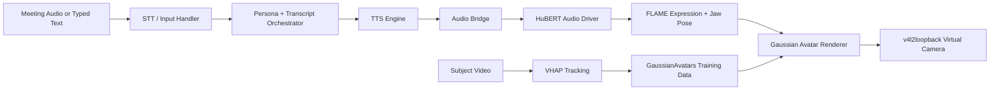

# TalkingHeadAvatar

TalkingHeadAvatar is an audio-driven 3D Gaussian Splatting avatar prototype. It combines a FLAME-rigged Gaussian avatar renderer, VHAP face tracking utilities, a HuBERT-style audio-to-expression driver, streaming TTS, meeting transcription/orchestration, and a Linux virtual camera output path.

The current repository is a research/engineering workspace for building a real-time talking head avatar from monocular subject data. It is not a polished package yet; it is meant to make the architecture, code, experiments, and local artifact contracts clear enough for continued development.

## System Overview



The runtime loop is designed around these steps:

1. Capture meeting audio or accept typed fallback text.
2. Convert participant speech to text with Whisper-style STT.
3. Maintain a rolling transcript and persona-conditioned prompt.
4. Generate avatar response text with the orchestration layer.
5. Stream response text through TTS.
6. Feed generated speech audio into an audio driver that predicts FLAME expression and jaw motion.
7. Render the avatar with GaussianAvatars-compatible FLAME-bound 3D Gaussian Splatting.
8. Submit frames to a virtual camera device for OBS, Meet, Zoom, Teams, or similar tools.

## Repository Layout

| Path | Description |
|---|---|
| `run_demo.py` | End-to-end runtime scaffold. Wires persona loading, optional Gemma orchestration, STT, TTS, audio-driven motion, renderer, and virtual camera output. |
| `avatar_renderer.py` | Real-time renderer wrapper around `GaussianAvatars.scene.FlameGaussianModel` and the GaussianAvatars rasterization pipeline. |
| `GaussianAvatars/` | Vendored GaussianAvatars renderer/training code and CUDA extension sources. |
| `VHAP/` | Vendored VHAP tracking/export tooling for producing FLAME parameters and NeRF/GaussianAvatars-style datasets. |
| `audio_driver/` | HuBERT-feature-based audio-to-FLAME motion driver. |
| `orchestrator/` | Meeting audio listener, STT wrapper, persona prompt builder, transcript manager, and Gemma loading utilities. |
| `tts_engine/` | Streaming TTS interface, Chatterbox-style engine wrapper, and TTS-to-audio-driver bridge. |
| `virtual_camera/` | `pyvirtualcam` integration for sending rendered frames to a v4l2loopback device. |
| `scripts/` | Dataset preparation, downloads, training helpers, monitoring helpers, and virtual camera setup scripts. |
| `tests/` | Unit and integration tests for renderer, parsing, orchestration, TTS bridge, VHAP export, and virtual camera behavior. |
| `data/` | Local subject datasets. Only `data/README.md` is tracked. |
| `output/` | Local training/render outputs. Only `output/README.md` is tracked. |
| `models/` | Local model weights. Only `models/README.md` is tracked. |
| `audio_driver/checkpoints/` | Local audio-driver checkpoints. Only the directory README is tracked. |
| `implementation_plan.md` | Detailed phased build plan and research notes. |
| `ARTIFACTS.md` | Inventory and policy for large local files that are intentionally excluded from git. |

## Current Capabilities

- Load an extracted GaussianAvatars-style checkpoint directory containing `point_cloud/`.
- Reconstruct a `FlameGaussianModel` and render idle or audio-driven frames.
- Preserve trained camera metadata from `cameras.json` when available.
- Stream frames into a Linux virtual camera via `pyvirtualcam`.
- Use `--video_only` mode to validate rendering/camera wiring without initializing audio or TTS dependencies.
- Use optional typed stdin fallback for local demo control.
- Load persona JSON and build meeting-aware orchestration prompts.
- Route generated TTS audio into the audio driver and optional system playback.

## Public Repository Scope

This public repo intentionally tracks code and documentation, not local experiment payloads.

Large files are excluded because many are either too large for normal GitHub blobs, generated during training, machine-specific, or governed by separate licenses/download terms. Examples include FLAME model assets, Gaussian point clouds, subject videos, extracted frame datasets, checkpoints, TensorBoard logs, GGUF/model weights, and `.venv`.

See [ARTIFACTS.md](ARTIFACTS.md) for the local artifact inventory and expected directory contracts.

## Requirements

The project is GPU-oriented. Exact dependencies depend on whether you only run tests, render video, train models, or run the full speech/TTS/orchestration stack.

Recommended development environment:

| Component | Recommendation |
|---|---|
| OS | Linux with v4l2loopback support. Fedora was used during development. |
| Python | Python 3.10+ recommended for most upstream avatar tooling. |
| GPU | NVIDIA GPU with CUDA for real-time rendering/training. |
| CUDA | Match the PyTorch build and local extension toolchain. |
| Camera output | `v4l2loopback` plus `pyvirtualcam`. |

The current local workspace used Python 3.14 in `.venv`, but some upstream research dependencies may be easier to install on Python 3.10 or 3.11.

## Installation

Create and activate an environment:

```bash
python -m venv .venv
. .venv/bin/activate
python -m pip install --upgrade pip
```

Install GaussianAvatars Python dependencies:

```bash
pip install -r GaussianAvatars/requirements.txt
```

Install CUDA extension packages from the vendored sources:

```bash
pip install GaussianAvatars/submodules/diff-gaussian-rasterization
pip install GaussianAvatars/submodules/simple-knn
```

Install VHAP if you need tracking/preprocessing:

```bash
pip install -e VHAP
```

Optional runtime components may require additional packages for TTS, STT, audio I/O, Gemma/GGUF loading, and virtual camera output. The repo currently keeps these integrations modular so `--video_only` can be used to validate the renderer path without the full audio stack.

## Local Artifacts

The following directories are expected to be populated locally, but their large contents are ignored by git:

```text
data/
output/
models/
audio_driver/checkpoints/
GaussianAvatars/flame_model/assets/flame/
VHAP/asset/flame/
```

### Subject Data

Expected per-subject structure:

```text
data/{subject}/
  transformsVHAP/
    canonical_flame_param.npz
    flame_param/
    transforms_train.json
    transforms_val.json
    transforms_test.json
  view_000/
    images/
    masks/
  audio_full.wav
  voice_reference.wav
  persona.json
```

### Avatar Checkpoints

`run_demo.py --avatar_ckpt` expects an extracted checkpoint directory, not a `.tar` file:

```text
output/{subject_or_run}/
  point_cloud/
    iteration_300000/
      point_cloud.ply
  cameras.json
  cfg_args
```

### Audio Driver Checkpoints

Expected local layout:

```text
audio_driver/checkpoints/{subject_or_run}/
  best_model.pt
  last_model.pt
  hubert_features_raw.pt
```

## Data Preparation

Record or obtain a subject video, then run VHAP-style tracking to produce FLAME parameters and camera transforms. The high-level flow is:

```bash
python scripts/preprocess_data.py
```

For demo assets, use:

```bash
./scripts/download_demo_character.sh
python scripts/prepare_demo_character.py
```

For detailed project phases and training notes, see [implementation_plan.md](implementation_plan.md).

## Running The Demo

The main entry point is `run_demo.py`.

### Video-Only Smoke Test

Use this first when validating renderer and virtual camera wiring:

```bash
python run_demo.py \
  --avatar_ckpt output/{subject_or_run} \
  --persona_file data/{subject}/persona.json \
  --camera_device /dev/video10 \
  --video_only
```

This skips TTS and the audio driver, renders neutral avatar frames, and submits them to the virtual camera.

### Dry Run

Use `--dry_run` when checking initialization without opening the camera device:

```bash
python run_demo.py \
  --avatar_ckpt output/{subject_or_run} \
  --persona_file data/{subject}/persona.json \
  --video_only \
  --dry_run
```

### Full Runtime Path

When avatar, audio-driver, voice reference, and camera artifacts are available:

```bash
python run_demo.py \
  --avatar_ckpt output/{subject_or_run} \
  --audio_driver_ckpt audio_driver/checkpoints/{subject_or_run}/best_model.pt \
  --persona_file data/{subject}/persona.json \
  --voice_ref data/{subject}/voice_reference.wav \
  --camera_device /dev/video10 \
  --resolution 512 \
  --fps 30 \
  --device cuda \
  --enable_stdin_fallback \
  --play_audio
```

Useful flags:

| Flag | Purpose |
|---|---|
| `--video_only` | Skip audio driver and TTS imports/init. Useful for renderer/camera checks. |
| `--dry_run` | Initialize without opening the virtual camera. |
| `--skip_gemma` | Bypass Gemma loading; typed text can still be routed through the fallback path. |
| `--skip_audio_listener` | Do not open live meeting audio capture. |
| `--disable_stt` | Keep audio listener off the STT path. |
| `--enable_stdin_fallback` | Accept typed participant text from stdin. |
| `--play_audio` | Play generated TTS audio locally while it also drives avatar motion. |
| `--emotion_mode` | Choose one of `neutral`, `engaged`, `emphatic`, or `concerned`. |

## Virtual Camera Setup

The avatar output path expects a v4l2loopback device, usually `/dev/video10`.

```bash
sudo ./scripts/setup_v4l2loopback.sh
```

If OBS sees a black frame, try the module settings documented in [virtual_camera/README.md](virtual_camera/README.md):

```bash
sudo OBS_EXCLUSIVE_CAPS=1 AVATAR_EXCLUSIVE_CAPS=0 ./scripts/setup_v4l2loopback.sh
```

Then point OBS, Meet, Zoom, or another application at `/dev/video10`.

## Testing

Run the test suite with:

```bash
pytest
```

Some tests depend on local artifacts, CUDA availability, or optional model packages. If a test fails because a checkpoint, FLAME asset, camera device, or model dependency is missing, check the relevant directory README and [ARTIFACTS.md](ARTIFACTS.md).

## Development Notes

This workspace uses `.git-local` as the local git database because the execution environment mounted `.git` as read-only during initial setup. A normal clone from GitHub will use the standard `.git` directory and does not need `.git-local`.

To inspect ignored local artifacts:

```bash
git status --ignored --short
```

To verify no oversized payloads are staged:

```bash
git diff --cached --name-only -z | xargs -0 du -h | sort -hr | head
```

## Public Release Notes

Before treating this as a polished public project, review these items:

- Add a root `LICENSE` if you want to define a license for original code in this repository.
- Keep third-party license files intact. GaussianAvatars and VHAP have their own licenses in their respective directories.
- Do not publish private subject videos, voice references, trained identity checkpoints, or biometric assets without permission.
- FLAME model assets are not redistributed here and must be obtained according to the FLAME license/download terms.
- Large model weights and training outputs should be distributed through GitHub Releases, Git LFS, Hugging Face, or object storage rather than normal git commits.

## Acknowledgements

This project builds on and vendors code from:

- GaussianAvatars: FLAME-bound 3D Gaussian avatar rendering/training.
- VHAP: monocular face tracking and FLAME parameter export.
- FLAME: parametric head model assets, distributed separately under their own terms.

Additional runtime components include STT, TTS, LLM/Gemma, PyTorch, CUDA extension, and Linux virtual camera tooling.
