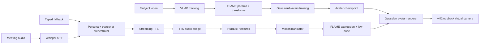

# TalkingHeadAvatar

TalkingHeadAvatar is a research implementation for a real-time, audio-driven 3D Gaussian Splatting talking head avatar. The project combines FLAME-bound Gaussian avatar rendering, VHAP-based face tracking, HuBERT audio features, a speaker-specific audio-to-motion model, streaming TTS, optional Gemma orchestration, and Linux virtual camera output.

The repository is organized as an end-to-end avatar pipeline, not as a Python package. The main integration target is `run_demo.py`; the training, preprocessing, and runtime pieces are kept as separate modules so they can be tested and replaced independently.

## Architecture



## Runtime Data Flow

1. `MeetingAudioListener` captures 16 kHz meeting audio into rolling chunks.
2. `MeetingSpeechRecognizer` transcribes chunks with a Whisper-compatible model.
3. `MeetingTranscript` stores recent participant and avatar turns.
4. `load_persona()` and `build_system_prompt()` inject persona context.
5. `load_gemma()` optionally loads a GGUF Gemma model through `llama-cpp-python`.
6. `process_gemma_output()` extracts `avatar_speak` tool payloads or falls back to sentence splitting.
7. `ChatterboxEngine` streams TTS audio, resampled from 24 kHz to 16 kHz.
8. `TTSAudioBridge` sends 16 kHz chunks into `StreamingAudioDriver`.
9. `StreamingAudioDriver` runs HuBERT and `MotionTranslator` to predict FLAME expression and jaw pose.
10. `AvatarRenderer` renders the current FLAME-driven Gaussian avatar frame.
11. `VirtualCameraOutput` sends RGB frames to `/dev/video10` or another v4l2loopback node.

## Repository Map

| Path | Technical role |
|---|---|
| `run_demo.py` | End-to-end runtime. Parses CLI flags, initializes persona/orchestrator, audio, TTS, renderer, and virtual camera loops. |
| `avatar_renderer.py` | Loads a GaussianAvatars checkpoint, selects a FLAME mesh timestep, builds camera matrices, and renders idle or driven frames. |
| `audio_driver/audio_encoder.py` | Frozen HuBERT feature extractor. Runtime input is 16 kHz mono audio. |
| `audio_driver/motion_translator.py` | Transformer model mapping HuBERT features `(B, T, 1024)` to expression `(B, T, n_expr)` and jaw pose `(B, T, 3)`. |
| `audio_driver/inference.py` | Streaming audio buffer, HuBERT inference, MotionTranslator inference, EMA smoothing, and latency reporting. |
| `orchestrator/` | Persona loading, transcript windowing, audio listener, STT wrapper, Gemma GGUF loader, and avatar tool-call parsing. |
| `tts_engine/` | Streaming TTS abstraction plus Chatterbox wrapper and TTS-to-HuBERT audio bridge. |
| `virtual_camera/` | Fixed-FPS RGB frame writer backed by `pyvirtualcam`. Includes idle frame generation for debugging black camera feeds. |
| `GaussianAvatars/` | Vendored GaussianAvatars renderer/training code and CUDA rasterizer sources. |
| `VHAP/` | Vendored face tracking and FLAME parameter export tooling. |
| `scripts/` | Setup, download, preprocessing, audio-driver training, monitoring, and virtual-camera helper scripts. |
| `tests/` | Unit and integration tests for parsing, rendering, orchestration, audio/TTS bridge, VHAP export, and camera behavior. |
| `data/` | Local subject data root. Only `data/README.md` is tracked. |
| `output/` | Local training and rendered-output root. Only `output/README.md` is tracked. |
| `models/` | Local model-weight root. Only `models/README.md` is tracked. |
| `audio_driver/checkpoints/` | Local MotionTranslator checkpoint root. Only the README is tracked. |
| `implementation_plan.md` | Project build plan and deeper research notes. |
| `ARTIFACTS.md` | Local artifact inventory for this workspace. |

## Core Components

### AvatarRenderer

`AvatarRenderer` expects an extracted GaussianAvatars-style checkpoint directory:

```text
output/{run_name}/
  point_cloud/
    iteration_{N}/
      point_cloud.ply
  cameras.json
  cfg_args
```

At initialization it:

- Finds the highest `point_cloud/iteration_*` directory.
- Parses `sh_degree` from `cfg_args` if present.
- Loads `FlameGaussianModel`.
- Uses `cameras.json` when available to preserve the trained coordinate system.
- Falls back to a fixed portrait camera if `cameras.json` is missing.
- Chooses a base timestep from the saved camera entry.
- Exposes `render_idle()` and audio-driven rendering through `render(expr, jaw)`.

### StreamingAudioDriver

`StreamingAudioDriver` is the real-time audio-to-FLAME inference path.

Input contract:

```text
audio_chunk: float32 mono audio at 16 kHz
shape:       (N,) or (1, N)
```

Internal processing:

- Sliding window buffer: 1 second by default.
- Hop size: 320 samples, equal to 20 ms at 16 kHz.
- Feature extractor: HuBERT, output dimension `1024`.
- Motion model: `MotionTranslator(causal=True)` for streaming use.
- Output: FLAME expression vector and jaw axis-angle vector.
- Smoothing: exponential moving average with default `ema_alpha=0.3`.

Output contract:

```text
expression: (n_expr,) float32
jaw_pose:   (3,) float32
```

### MotionTranslator

The MotionTranslator is a speaker-specific Transformer regression model.

Default architecture:

```text
input dim:       1024 HuBERT features
encoder:         4 Transformer encoder layers
attention heads: 8
feed-forward:    2048
expression head: LayerNorm + Linear -> n_expr
jaw head:        LayerNorm + Linear + Tanh -> 3
loss:            L1 expression + weighted L1 jaw + expression velocity loss
```

The model is trained from VHAP FLAME parameter sequences paired with subject audio.

### TTS Engine

`ChatterboxEngine` wraps Chatterbox TTS behind `BaseTTSEngine`.

Runtime behavior:

- Loads the model lazily on first synthesis call.
- Supports optional voice reference audio.
- Uses `generate_stream()` when available.
- Falls back to sentence-by-sentence generation.
- Resamples generated audio from 24 kHz to 16 kHz for HuBERT.
- Maps emotion modes to Chatterbox exaggeration:

| Emotion mode | Exaggeration |
|---|---:|
| `neutral` | 0.45 |
| `engaged` | 0.65 |
| `emphatic` | 0.90 |
| `concerned` | 0.60 |

### Orchestrator

The orchestrator can run with or without Gemma.

With Gemma enabled:

- `load_gemma()` loads a GGUF model using `llama-cpp-python`.
- `GEMMA_GGUF_PATH` can point to a local `.gguf` file.
- `GEMMA_N_GPU_LAYERS` controls GPU offload. `-1` means all layers.
- `GEMMA_N_CTX` controls context length.
- The model is prompted with persona + rolling transcript context.
- Tool payloads are parsed as `avatar_speak`.

Without Gemma:

- `--skip_gemma` bypasses LLM loading.
- `--enable_stdin_fallback` can still feed text directly to the avatar response queue.

### Virtual Camera

`VirtualCameraOutput` writes RGB frames to a v4l2loopback device.

Default output:

```text
device: /dev/video10
format: RGB
size:   512 x 512
fps:    30
```

The writer runs on a background thread. It emits an animated idle frame if no rendered frame is available, which makes camera setup problems easier to debug than a solid black output.

## Environment

Recommended baseline:

| Component | Recommendation |
|---|---|
| OS | Linux with v4l2loopback support |
| Python | 3.10 or 3.11 for upstream research dependency compatibility |
| GPU | NVIDIA CUDA GPU for rendering and training |
| PyTorch | CUDA build matching the installed driver/toolkit |
| Camera | `v4l2loopback` and `pyvirtualcam` |
| Audio | `sounddevice`, `torchaudio`, `librosa` or `soundfile` |

The workspace has been tested during development on Fedora. Some research dependencies may compile more reliably on Python 3.10 than on newer Python versions.

## Installation

Create an environment:

```bash
python -m venv .venv
. .venv/bin/activate
python -m pip install --upgrade pip
```

Install GaussianAvatars dependencies:

```bash
pip install -r GaussianAvatars/requirements.txt
```

Install CUDA extension modules:

```bash
pip install GaussianAvatars/submodules/diff-gaussian-rasterization
pip install GaussianAvatars/submodules/simple-knn
```

Install VHAP in editable mode when using its tracking/export tools:

```bash
pip install -e VHAP
```

Install optional LLM support:

```bash
./scripts/install_llama_cpp_python.sh
./scripts/download_gemma_gguf.sh
export GEMMA_GGUF_PATH="$PWD/models/gemma-4-e4b-it-Q4_K_M.gguf"
```

Install optional audio/data helpers as needed:

```bash
pip install transformers soundfile librosa pyvirtualcam sounddevice
```

TTS requires the Chatterbox package used by `tts_engine/synthesizer.py`. Install the version compatible with your CUDA/PyTorch environment.

## Required Local Assets

The repository does not include private subject data, generated checkpoints, downloaded LLM weights, or FLAME assets. The runtime and training scripts expect those files to be present locally.

### FLAME Assets

Required by GaussianAvatars and VHAP:

```text
GaussianAvatars/flame_model/assets/flame/
  flame2023.pkl
  FLAME_masks.pkl
  landmark_embedding_with_eyes.npy
  head_template_mesh.obj
  tex_mean_painted.png

VHAP/asset/flame/
  flame2023.pkl
  FLAME_masks.pkl
  landmark_embedding_with_eyes.npy
  head_template_mesh.obj
  tex_mean_painted.png
```

Obtain FLAME assets from the official FLAME distribution and place them in the expected directories.

### Subject Dataset

Expected subject layout:

```text
data/{subject}/
  transformsVHAP/
    canonical_flame_param.npz
    flame_param/
      000000.npz
      000001.npz
      ...
    transforms_train.json
    transforms_val.json
    transforms_test.json
  view_000/
    images/
    masks/
  audio_full.wav
  voice_reference.wav
  persona.json
```

`audio_full.wav` should be 16 kHz mono for audio-driver training. `voice_reference.wav` should be a clean 30 to 60 second segment for voice cloning.

### Persona JSON

`run_demo.py` requires `--persona_file`.

Minimal shape:

```json
{
  "name": "Subject Name",
  "role": "Role or title",
  "communication_style": "Concise, direct, technical",
  "vocabulary_patterns": ["phrase one", "phrase two"],
  "domain_expertise": ["topic one", "topic two"],
  "known_opinions": {
    "topic": "position"
  },
  "biographical_context": "Short background used by the orchestrator.",
  "tone_guardrails": "How responses should sound."
}
```

### Avatar Checkpoint

`--avatar_ckpt` must point at an extracted directory, not a `.tar` archive:

```text
output/{subject_or_run}/
  point_cloud/
    iteration_300000/
      point_cloud.ply
  cameras.json
  cfg_args
```

### Audio Driver Checkpoint

Expected checkpoint path for full runtime:

```text
audio_driver/checkpoints/{subject_or_run}/best_model.pt
```

If this is omitted, `StreamingAudioDriver` creates an untrained `MotionTranslator`, which is useful for plumbing tests but will not produce meaningful facial motion.

## Data Preparation

Validate a subject directory and generate missing audio/persona helper files:

```bash
python scripts/preprocess_data.py \
  --subject {subject} \
  --video /path/to/source_video.mp4
```

The script checks:

- `transformsVHAP/canonical_flame_param.npz`
- `transformsVHAP/flame_param/*.npz`
- `transforms_train.json`, `transforms_val.json`, `transforms_test.json`
- `view_000/images`
- `view_000/masks`
- `audio_full.wav`
- `voice_reference.wav`
- `persona.json`

Prepare a downloaded demo character:

```bash
./scripts/download_demo_character.sh
python scripts/prepare_demo_character.py \
  --character biden_001 \
  --force
```

## Training The Audio Driver

Train the subject-specific MotionTranslator from VHAP FLAME parameters and subject audio:

```bash
python scripts/train_audio_driver.py \
  --flame_params data/{subject}/transformsVHAP/flame_param \
  --audio_path data/{subject}/audio_full.wav \
  --output_dir audio_driver/checkpoints/{subject} \
  --epochs 100 \
  --lr 1e-4 \
  --batch_size 32 \
  --context_frames 50
```

Training details:

- Audio is loaded and resampled to 16 kHz.
- HuBERT features are precomputed to avoid repeated encoder passes.
- FLAME expression and jaw labels are aligned to the HuBERT feature timeline.
- The checkpoint stores model config and `state_dict`.

## Running

### Renderer and Camera Smoke Test

Use this first. It validates avatar checkpoint loading and virtual camera output without importing TTS or audio-driver dependencies:

```bash
python run_demo.py \
  --avatar_ckpt output/{subject_or_run} \
  --persona_file data/{subject}/persona.json \
  --camera_device /dev/video10 \
  --resolution 512 \
  --fps 30 \
  --device cuda \
  --video_only
```

### Initialization Dry Run

Use `--dry_run` to check initialization without opening the camera device:

```bash
python run_demo.py \
  --avatar_ckpt output/{subject_or_run} \
  --persona_file data/{subject}/persona.json \
  --video_only \
  --dry_run
```

### Full Interactive Demo

```bash
python run_demo.py \
  --avatar_ckpt output/{subject_or_run} \
  --audio_driver_ckpt audio_driver/checkpoints/{subject}/best_model.pt \
  --persona_file data/{subject}/persona.json \
  --voice_ref data/{subject}/voice_reference.wav \
  --camera_device /dev/video10 \
  --resolution 512 \
  --fps 30 \
  --device cuda \
  --enable_stdin_fallback \
  --play_audio
```

### Useful Runtime Flags

| Flag | Behavior |
|---|---|
| `--avatar_ckpt` | Required. Extracted avatar checkpoint directory containing `point_cloud/`. |
| `--audio_driver_ckpt` | Optional MotionTranslator checkpoint. Without it, the driver is untrained. |
| `--persona_file` | Required persona JSON path. |
| `--voice_ref` | Optional voice reference WAV for TTS voice conditioning. |
| `--camera_device` | v4l2loopback output node. Default: `/dev/video10`. |
| `--resolution` | Square render output resolution. Default: `512`. |
| `--fps` | Fixed render/camera loop rate. Default: `30`. |
| `--device` | `cuda` or `cpu`. Default: `cuda`. |
| `--video_only` | Skip TTS and audio driver imports/init. |
| `--dry_run` | Do not open the virtual camera device. |
| `--skip_gemma` | Do not load Gemma. |
| `--skip_audio_listener` | Do not start meeting audio capture. |
| `--disable_stt` | Do not run STT over captured audio. |
| `--stt_model` | Hugging Face ASR model id. Default: `openai/whisper-tiny.en`. |
| `--stt_language` | STT language hint. Default: `en`. |
| `--enable_stdin_fallback` | Read participant text from stdin. |
| `--play_audio` | Play generated TTS audio locally. |
| `--audio_output_device` | Optional sounddevice output device. |
| `--emotion_mode` | One of `neutral`, `engaged`, `emphatic`, `concerned`. |

## Virtual Camera Setup

Create or reload the v4l2loopback devices:

```bash
sudo ./scripts/setup_v4l2loopback.sh
```

Recommended for OBS reader compatibility:

```bash
sudo OBS_EXCLUSIVE_CAPS=1 AVATAR_EXCLUSIVE_CAPS=0 ./scripts/setup_v4l2loopback.sh
```

Debug the output node:

```bash
ls -l /dev/video10
fuser -v /dev/video10
```

If another process is publishing to the same device, stop it before starting `run_demo.py`.

## Gemma GGUF Runtime

Download a GGUF model:

```bash
./scripts/download_gemma_gguf.sh Q4_K_M
export GEMMA_GGUF_PATH="$PWD/models/gemma-4-e4b-it-Q4_K_M.gguf"
```

Optional environment variables:

```bash
export GEMMA_N_GPU_LAYERS=-1
export GEMMA_N_CTX=4096
```

`load_gemma()` returns a `llama_cpp.Llama` instance and `None` for the processor. `run_demo.py` adapts token counting through `_TranscriptTokenizerAdapter`.

## Testing

Run all tests:

```bash
pytest
```

Run targeted tests:

```bash
pytest tests/test_orchestrator_transcript.py
pytest tests/test_tts_audio_bridge.py
pytest tests/test_virtual_camera_output.py
pytest tests/test_gaussian_render.py
```

Some tests require CUDA, FLAME assets, trained checkpoints, or optional runtime packages. Use `--video_only` and focused tests when validating a partial environment.

## Debugging Checklist

### `Camera device not found`

- Confirm v4l2loopback is loaded.
- Confirm `/dev/video10` exists.
- Run `sudo ./scripts/setup_v4l2loopback.sh`.
- Check whether OBS or another producer is using the device with `fuser -v /dev/video10`.

### OBS shows black

- Run `run_demo.py --video_only`.
- Confirm the log prints `[VirtualCameraOutput] Opened /dev/video10`.
- Reload loopback with `AVATAR_EXCLUSIVE_CAPS=0`.
- Make sure OBS is reading `/dev/video10`, not OBS's own virtual camera output.

### Audio stack import fails

- Check that `torch` and `torchaudio` versions match.
- Use `--video_only` to isolate renderer/camera issues.
- Install audio packages only after the CUDA/PyTorch environment is stable.

### Avatar checkpoint fails to load

- Confirm `--avatar_ckpt` points to an extracted directory.
- Confirm `point_cloud/iteration_*/point_cloud.ply` exists.
- Confirm required FLAME assets are present.
- Confirm CUDA rasterizer extensions were installed successfully.

### Gemma fails to load

- Check `GEMMA_GGUF_PATH`.
- Check that `llama-cpp-python` was built with CUDA if GPU offload is expected.
- Reduce `GEMMA_N_GPU_LAYERS` if VRAM is tight.

## Version Control And Artifacts

The repository tracks source code, tests, scripts, and small documentation files. Runtime assets remain local:

```text
data/
output/
models/
audio_driver/checkpoints/
GaussianAvatars/flame_model/assets/flame/
VHAP/asset/flame/
```

Do not commit subject videos, voice references, trained identity checkpoints, downloaded model weights, generated TensorBoard logs, extracted frame datasets, or private biometric assets. Use a separate artifact store for those files.

## Licensing Notes

This repository vendors third-party research code. Keep their license files intact:

- `GaussianAvatars/LICENSE.md`
- `GaussianAvatars/LICENSE_GS.md`
- `VHAP/LICENSE`

FLAME assets are not included and must be obtained under the FLAME license terms. Before publishing original code under a specific license, add a root `LICENSE` file and verify compatibility with the vendored components.

## Current Development Status

Implemented:

- End-to-end runtime scaffold in `run_demo.py`.
- GaussianAvatars checkpoint loading and frame rendering wrapper.
- Streaming audio driver and MotionTranslator model.
- Chatterbox TTS wrapper and audio bridge.
- Gemma GGUF loader and avatar tool-call parser.
- v4l2loopback virtual camera output.
- Dataset/artifact directory contracts.
- Regression tests for core glue modules.

Still project-specific:

- Actual avatar quality depends on locally trained checkpoints.
- Audio-driven motion quality depends on subject-specific MotionTranslator training.
- Full meeting behavior depends on local STT/TTS/Gemma dependencies and available VRAM.
- FLAME assets and subject datasets must be supplied by the user.
