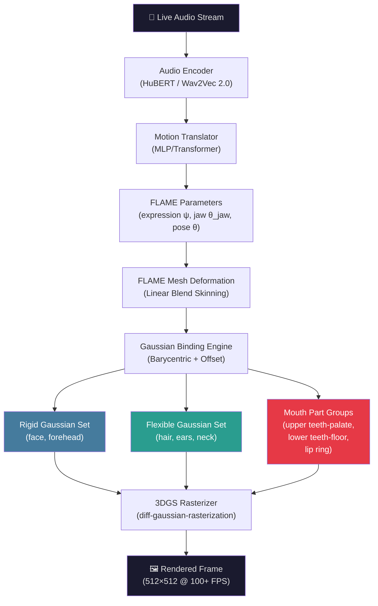
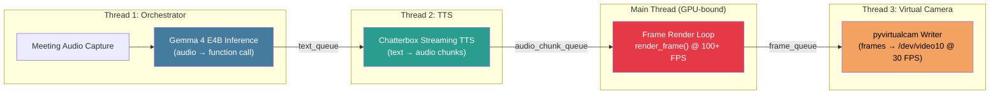

# Build Plan: GaussianAvatars + GeoAvatar Mouth Architecture — Audio-Driven 3DGS Talking Head

## Goal
Build a high-quality, real-time (100+ FPS) photorealistic talking head avatar system by combining:
1. **GaussianAvatars** (CVPR 2024) as the rendering backbone — FLAME-rigged 3D Gaussian Splatting
2. **GeoAvatar** (ICCV 2025) innovations — adaptive rigid/flexible Gaussian segmentation + enhanced mouth structure with part-wise deformation
3. **GaussianTalker**-style audio driver — HuBERT-based audio-to-FLAME expression prediction

> [!IMPORTANT]
> **Critical Discovery**: GeoAvatar's **training code is NOT publicly released** due to Klleon AI's corporate policy. Only pretrained weights and `render.py` are available. This means GeoAvatar's innovations (APS, mouth structure, part-wise deformation) **must be reverse-engineered from the paper and implemented into the GaussianAvatars codebase from scratch**.

---

## Architecture Overview



---

## Source Repositories

| Component | Repository | License | Code Available |
|---|---|---|---|
| **GaussianAvatars** (base) | [ShenhanQian/GaussianAvatars](https://github.com/ShenhanQian/GaussianAvatars) | CC-BY-NC-SA-4.0 | ✅ Full (train + render + viewer) |
| **GeoAvatar** (reference) | [seungjun-moon/geoavatar](https://github.com/seungjun-moon/geoavatar) | — | ⚠️ Render + pretrained weights ONLY. **No training code.** |
| **VHAP** (face tracker) | [ShenhanQian/VHAP](https://github.com/ShenhanQian/VHAP) | — | ✅ Full |
| **GaussianTalker** (audio ref) | [KU-CVLAB/GaussianTalker](https://github.com/KU-CVLAB/GaussianTalker) | — | ✅ Full |
| **FLAME** (parametric model) | [flame.is.tue.mpg.de](https://flame.is.tue.mpg.de/) | Academic | ✅ (requires registration) |

---

## Hardware Requirements

| Resource | Minimum | Recommended |
|---|---|---|
| **GPU** | RTX 3090 (24GB VRAM) | RTX 4090 (24GB VRAM) |
| **CPU** | 8-core | 16-core |
| **RAM** | 32GB | 64GB |
| **Storage** | 100GB SSD | 500GB NVMe |
| **CUDA** | 11.7+ | 12.1+ |

---

## Phase 1: Environment & Base System (Week 1)

### 1.1 Clone and Set Up GaussianAvatars

```bash
# Clone with submodules (includes diff-gaussian-rasterization, simple-knn)
git clone --recursive https://github.com/ShenhanQian/GaussianAvatars.git
cd GaussianAvatars

# Create conda environment
conda create --name ga_avatar -y python=3.10
conda activate ga_avatar

# Install PyTorch (match your CUDA version)
pip install torch torchvision torchaudio --index-url https://download.pytorch.org/whl/cu121

# Install CUDA toolkit
conda install -c "nvidia/label/cuda-12.1.0" cuda-toolkit

# Install submodules
pip install submodules/diff-gaussian-rasterization
pip install submodules/simple-knn

# Install remaining dependencies
pip install -r requirements.txt

# Install nvdiffrast (for mesh rendering)
pip install git+https://github.com/NVlabs/nvdiffrast
```

### 1.2 Download Required Assets

| Asset | Source | Destination |
|---|---|---|
| `flame2023.pkl` | [FLAME website](https://flame.is.tue.mpg.de/download.php) | `flame_model/assets/flame/` |
| `FLAME_masks.pkl` | Same FLAME download | `flame_model/assets/flame/` |
| FLAME texture space | Same FLAME download | `flame_model/assets/flame/` |

### 1.3 Verify Base System

```bash
# Test with provided demo model
python local_viewer.py --point_path media/306/point_cloud.ply
```

> [!NOTE]
> The local viewer is Python-based and NOT representative of actual rendering FPS. Use `fps_benchmark_demo.py` for accurate performance measurement.

### 1.4 Code Structure to Understand

```
GaussianAvatars/
├── train.py                    # Main training entry point
├── render.py                   # Offline rendering
├── local_viewer.py             # Interactive viewer (DearPyGUI)
├── fps_benchmark_demo.py       # FPS measurement script
├── metrics.py                  # PSNR/SSIM/LPIPS evaluation
├── arguments/                  # Argument parsers
├── flame_model/                # FLAME model wrapper
│   ├── flame.py                # FLAME forward pass, LBS
│   └── assets/flame/           # FLAME pkl files go here
├── gaussian_renderer/          # Rasterization wrapper
│   └── __init__.py             # render() function
├── scene/                      # Core scene representation
│   ├── gaussian_model.py       # GaussianModel class — KEY FILE
│   ├── dataset_readers.py      # Data loading
│   └── cameras.py              # Camera model
├── mesh_renderer/              # NVDiffRast mesh rendering
├── submodules/                 # C++/CUDA extensions
│   ├── diff-gaussian-rasterization/
│   └── simple-knn/
└── utils/                      # Loss functions, helpers
```

**Key file**: `scene/gaussian_model.py` — contains the Gaussian-to-FLAME binding logic (barycentric coordinates, displacement offsets). **This is where GeoAvatar modifications go.**

---

## Phase 2: Data Acquisition & Preprocessing (Week 1-2)

### 2.1 Record Training Video

**Requirements for high-quality avatar**:
- 3-5 minutes of monocular video
- 1080p minimum resolution
- Consistent lighting (soft, frontal)
- Full range of expressions: talking, smiling, frowning, surprise, eye movements
- Moderate head rotation (±30° yaw, ±15° pitch)
- Static background (easier segmentation)

### 2.2 Run VHAP Face Tracker

```bash
# Clone VHAP
git clone https://github.com/ShenhanQian/VHAP.git
cd VHAP

# Install dependencies (follow VHAP README)
pip install -r requirements.txt

# Run tracking on your video
python track.py \
    --input_video /path/to/your/video.mp4 \
    --output_dir /path/to/tracked_output/ \
    --flame_model_path /path/to/flame2023.pkl
```

**VHAP outputs**:
- `canonical_flame_param.npz` — identity shape parameters
- `flame_param/` — per-frame FLAME parameters (expression, pose, translation)
- `transforms_train.json`, `transforms_val.json`, `transforms_test.json`
- `images/` — extracted and cropped frames
- `masks/` — background segmentation masks

### 2.3 Prepare Dataset Structure

```
data/your_subject/
├── transformsVHAP/              # or transformsMetracker
│   ├── canonical_flame_param.npz
│   ├── flame_param/
│   │   ├── 000000.npz
│   │   ├── 000001.npz
│   │   └── ...
│   ├── transforms_train.json
│   ├── transforms_val.json
│   └── transforms_test.json
└── view_000/
    ├── images/
    │   ├── 000000.png
    │   └── ...
    └── masks/
        ├── 000000.png
        └── ...
```

---

## Phase 3: GeoAvatar Mouth Structure Implementation (Week 2-3)

> [!CAUTION]
> This is the most technically challenging phase. GeoAvatar's training code is not released, so these modifications must be implemented from scratch based on the paper's description and the available `render.py` / pretrained weights for reference.

### 3.1 Extend FLAME Mesh with Inner Mouth Geometry

**What to implement** (from GeoAvatar paper):
The standard FLAME mesh has NO inner mouth geometry. GeoAvatar manually constructs:
1. **Frontal teeth** — generated using vertex trajectories of the lip ring vertices
2. **Molar teeth** — additional tooth geometry beyond the front-facing teeth
3. **Palate** (roof of mouth) — a surface connecting upper teeth to the soft palate
4. **Floor of mouth** — a surface beneath the tongue

**Implementation approach**:

#### [MODIFY] `flame_model/flame.py`

```python
# Add method to construct inner mouth geometry
def construct_mouth_structure(self, flame_params):
    """
    Constructs inner mouth mesh parts from FLAME lip ring vertices.
    
    Returns:
        mouth_parts: dict with keys:
            - 'upper_teeth_palate': (V_upper, F_upper)  # vertices, faces
            - 'lower_teeth_floor': (V_lower, F_lower)
            - 'frontal_teeth': (V_front, F_front)
    """
    # 1. Extract lip ring vertex indices from FLAME_masks.pkl
    lip_ring_upper = self.flame_masks['lips'][:N_upper]
    lip_ring_lower = self.flame_masks['lips'][N_upper:]
    
    # 2. Generate frontal teeth by offsetting lip ring vertices inward
    #    along the surface normal, scaled by jaw opening angle
    lip_normals = compute_vertex_normals(vertices, faces, lip_ring_upper)
    teeth_offset = lip_normals * TEETH_DEPTH  # ~5-8mm inward
    frontal_teeth_verts = vertices[lip_ring_upper] + teeth_offset
    
    # 3. Construct palate as a smooth surface spanning upper lip ring
    palate_verts = interpolate_palate(lip_ring_upper, vertices, depth=PALATE_DEPTH)
    
    # 4. Construct mouth floor similarly from lower lip ring
    floor_verts = interpolate_floor(lip_ring_lower, vertices, depth=FLOOR_DEPTH)
    
    # 5. Create triangle faces for each part
    # ...
    
    return mouth_parts
```

### 3.2 Implement Adaptive Pre-allocation Stage (APS)

**What it does**: Unsupervised segmentation of Gaussians into **rigid** and **flexible** sets based on the magnitude of their displacement offsets from the FLAME mesh.

#### [MODIFY] `scene/gaussian_model.py`

```python
def adaptive_preallocate(self):
    """
    APS: Classify each Gaussian as rigid or flexible based on
    the magnitude of its local mean offset from the bound mesh triangle.
    
    Rigid: Gaussians where the offset magnitude is small (face, lips)
           → strong offset regularization (keep close to mesh)
    Flexible: Gaussians where the offset magnitude is large (hair, ears)
              → weak offset regularization (allow larger deviations)
    """
    offsets = self._offset  # (N, 3) displacement vectors
    offset_magnitudes = torch.norm(offsets, dim=-1)  # (N,)
    
    # Compute per-region statistics
    # Use FLAME face masks to compute region-wise thresholds
    threshold = compute_adaptive_threshold(offset_magnitudes, self.binding_faces)
    
    self.rigid_mask = offset_magnitudes < threshold   # Boolean (N,)
    self.flexible_mask = ~self.rigid_mask
```

### 3.3 Implement Part-wise Mouth Deformation

**Key insight from GeoAvatar**: Gaussians within the same anatomical mouth part (e.g., all upper teeth + palate Gaussians) are deformed using a **single consistent offset** rather than independent per-Gaussian offsets. This prevents tearing artifacts.

#### [MODIFY] `scene/gaussian_model.py`

```python
def assign_mouth_part_groups(self):
    """
    Assign Gaussians bound to mouth-region triangles into anatomical groups.
    Each group shares a single rigid-body deformation.
    
    Groups:
    - GROUP_UPPER_TEETH_PALATE: moves with maxilla (fixed relative to skull)
    - GROUP_LOWER_TEETH_FLOOR: moves with mandible (jaw bone)
    - GROUP_LIP_RING: deforms with lip vertices (flexible)
    """
    mouth_face_ids = self.flame_masks['mouth']  # triangle IDs
    
    for gaussian_idx in range(self.num_gaussians):
        bound_face = self.binding_faces[gaussian_idx]
        if bound_face in upper_teeth_palate_faces:
            self.mouth_group[gaussian_idx] = GROUP_UPPER_TEETH_PALATE
        elif bound_face in lower_teeth_floor_faces:
            self.mouth_group[gaussian_idx] = GROUP_LOWER_TEETH_FLOOR
        # lip ring Gaussians keep per-Gaussian offsets (no grouping)


def apply_partwise_deformation(self, flame_params):
    """
    Apply consistent offset to mouth part groups.
    Instead of per-Gaussian offsets, compute a single rigid transform
    per anatomical group.
    """
    # Upper teeth/palate: rigid body attached to maxilla
    upper_transform = compute_rigid_transform(
        flame_params, part='upper_jaw'
    )
    self._xyz[self.mouth_group == GROUP_UPPER_TEETH_PALATE] = \
        apply_rigid(self._xyz_canonical[mask], upper_transform)
    
    # Lower teeth/floor: rigid body attached to mandible
    jaw_angle = flame_params['jaw_pose']  # θ_jaw from FLAME
    lower_transform = compute_jaw_transform(jaw_angle)
    self._xyz[self.mouth_group == GROUP_LOWER_TEETH_FLOOR] = \
        apply_rigid(self._xyz_canonical[mask], lower_transform)
```

### 3.4 Add Rigging Regularization Loss

**From GeoAvatar**: A regularization loss ensuring tight coupling between Gaussians and their bound mesh triangles, with adaptive strength based on rigid/flexible classification.

#### [MODIFY] `utils/loss_utils.py`

```python
def rigging_regularization_loss(gaussian_model):
    """
    L_rig = λ_rigid * ||offset_rigid||² + λ_flex * ||offset_flex||²
    
    where λ_rigid >> λ_flex (rigid Gaussians penalized heavily for large offsets)
    """
    offsets = gaussian_model._offset
    rigid_mask = gaussian_model.rigid_mask
    flexible_mask = gaussian_model.flexible_mask
    
    loss_rigid = (offsets[rigid_mask] ** 2).mean() * LAMBDA_RIGID     # e.g., 10.0
    loss_flex = (offsets[flexible_mask] ** 2).mean() * LAMBDA_FLEX     # e.g., 0.1
    
    return loss_rigid + loss_flex
```

---

## Phase 4: Train the Enhanced Avatar (Week 3-4)

### 4.1 Modified Training Command

```bash
SUBJECT=your_subject

python train.py \
    -s data/${SUBJECT}/transformsVHAP \
    -m output/${SUBJECT}_geoavatar_enhanced \
    --eval \
    --bind_to_mesh \
    --white_background \
    --iterations 300000 \
    --enable_aps \                    # New flag: Adaptive Pre-allocation
    --enable_mouth_structure \        # New flag: Extended mouth geometry
    --enable_partwise_deformation \   # New flag: Part-wise mouth deformation
    --lambda_rigid 10.0 \
    --lambda_flex 0.1 \
    --port 60000
```

### 4.2 Training Schedule

| Stage | Iterations | What Happens |
|---|---|---|
| 0 – 5K | Warm-up | Initialize Gaussians on FLAME mesh; basic photometric loss |
| 5K – 30K | Base optimization | Standard GaussianAvatars training; Gaussians learn offsets |
| 30K – 50K | **APS activation** | Run APS to classify rigid/flexible; apply adaptive regularization |
| 50K – 100K | Mouth structure | Initialize inner mouth Gaussians; begin part-wise deformation |
| 100K – 300K | Full optimization | Joint optimization of all components; evaluate on val set every 10K |

### 4.3 Evaluation Checkpoints

```bash
# Run metrics on test set (self-reenactment)
python metrics.py \
    -m output/${SUBJECT}_geoavatar_enhanced \
    --iteration 300000

# FPS benchmark
python fps_benchmark_demo.py \
    --point_path output/${SUBJECT}_geoavatar_enhanced/point_cloud/iteration_300000/point_cloud.ply
```

**Target metrics**:
| Metric | Target | SOTA Reference |
|---|---|---|
| PSNR | >32 dB | GaussianAvatars: ~30-33 dB |
| SSIM | >0.95 | GaussianAvatars: ~0.94-0.96 |
| LPIPS | <0.04 | GaussianAvatars: ~0.03-0.05 |
| FPS | >100 | GaussianAvatars: 60-100+ |

---

## Phase 5: Audio Driver Integration (Week 4-5)

### 5.1 Build the Audio-to-FLAME Pipeline

This module converts live audio into FLAME expression parameters. Adapted from GaussianTalker's Speaker-specific Motion Translator.

#### [NEW] `audio_driver/audio_encoder.py`

```python
"""
Audio feature extraction using HuBERT.
Causal-compatible for real-time streaming.
"""
import torch
from transformers import HubertModel

class AudioEncoder(torch.nn.Module):
    def __init__(self, model_name='facebook/hubert-large-ls960-ft'):
        super().__init__()
        self.hubert = HubertModel.from_pretrained(model_name)
        self.hubert.eval()
        # Freeze HuBERT weights
        for param in self.hubert.parameters():
            param.requires_grad = False
    
    def forward(self, audio_waveform):
        """
        Input: audio_waveform (B, T) at 16kHz
        Output: features (B, T', 1024) where T' = T / 320
        """
        with torch.no_grad():
            outputs = self.hubert(audio_waveform)
        return outputs.last_hidden_state
```

#### [NEW] `audio_driver/motion_translator.py`

```python
"""
Maps HuBERT audio features → FLAME expression + jaw parameters.
Speaker-specific: fine-tuned per subject.
"""
import torch
import torch.nn as nn

class MotionTranslator(nn.Module):
    def __init__(self, audio_dim=1024, flame_expr_dim=50, flame_jaw_dim=3):
        super().__init__()
        self.temporal_encoder = nn.TransformerEncoder(
            nn.TransformerEncoderLayer(
                d_model=audio_dim, nhead=8, dim_feedforward=2048,
                dropout=0.1, batch_first=True
            ),
            num_layers=4
        )
        self.expr_head = nn.Linear(audio_dim, flame_expr_dim)
        self.jaw_head = nn.Linear(audio_dim, flame_jaw_dim)
    
    def forward(self, audio_features):
        """
        Input: audio_features (B, T, 1024)
        Output: 
            expression (B, T, 50)  — FLAME expression coefficients
            jaw_pose (B, T, 3)     — jaw rotation (axis-angle)
        """
        encoded = self.temporal_encoder(audio_features)
        expression = self.expr_head(encoded)
        jaw_pose = self.jaw_head(encoded)
        return expression, jaw_pose
```

### 5.2 Train the Audio Driver

```bash
# Train motion translator on tracked FLAME params from the subject's video
python train_audio_driver.py \
    --flame_params data/${SUBJECT}/transformsVHAP/flame_param/ \
    --audio_path data/${SUBJECT}/audio.wav \
    --output_dir audio_driver/checkpoints/${SUBJECT}/ \
    --epochs 100 \
    --lr 1e-4
```

**Training data**: The VHAP tracker produces per-frame FLAME parameters. Pair these with the corresponding audio frames to create (audio_chunk → FLAME_params) training pairs.

### 5.3 Real-Time Inference Pipeline

#### [NEW] `inference.py`

```python
"""
End-to-end real-time inference:
Audio stream → FLAME params → Gaussian deformation → Rendered frame
"""

class AvatarInferencePipeline:
    def __init__(self, avatar_ckpt, audio_driver_ckpt, device='cuda'):
        # Load trained Gaussian avatar
        self.gaussian_model = load_gaussian_model(avatar_ckpt)
        self.flame_model = load_flame()
        
        # Load audio driver
        self.audio_encoder = AudioEncoder().to(device)
        self.motion_translator = MotionTranslator.load(audio_driver_ckpt).to(device)
        
        # Rasterizer settings
        self.raster_settings = setup_rasterizer(resolution=512)
    
    @torch.no_grad()
    def render_frame(self, audio_chunk, camera):
        """
        Process a single audio chunk and return a rendered frame.
        Latency target: <10ms per frame (100+ FPS).
        """
        # 1. Audio → features (~2ms)
        features = self.audio_encoder(audio_chunk)
        
        # 2. Features → FLAME params (~1ms)
        expression, jaw_pose = self.motion_translator(features)
        
        # 3. FLAME forward pass → deformed mesh (~1ms)
        flame_output = self.flame_model(
            expression=expression[-1],  # latest frame
            jaw_pose=jaw_pose[-1],
            # shape, neck_pose, eye_pose from canonical
        )
        
        # 4. Deform Gaussians via binding (~1ms)
        self.gaussian_model.update_binding(flame_output.vertices, flame_output.faces)
        
        # 5. Rasterize (~3-5ms)
        rendered = rasterize(self.gaussian_model, camera, self.raster_settings)
        
        return rendered  # (3, H, W) RGB tensor
```

---

## Phase 6: Optimization & Production Hardening (Week 5-6)

### 6.1 Gaussian Pruning for Speed

```python
# After training, prune low-opacity Gaussians
opacity_threshold = 0.01
keep_mask = gaussian_model.get_opacity > opacity_threshold
gaussian_model.prune(~keep_mask)

# Target: reduce from ~100K to ~30-50K Gaussians without quality loss
```

### 6.2 FP16 Inference

```python
# Convert model to half precision for inference
gaussian_model = gaussian_model.half()
flame_model = flame_model.half()
audio_encoder = audio_encoder.half()
motion_translator = motion_translator.half()
```

### 6.3 Streaming Audio Buffer

```python
class StreamingAudioBuffer:
    """
    Manages real-time audio input with a sliding window.
    Compatible with causal (non-lookahead) inference.
    """
    def __init__(self, chunk_size=320*5, overlap=320*2):
        self.chunk_size = chunk_size  # ~100ms at 16kHz
        self.overlap = overlap
        self.buffer = torch.zeros(chunk_size)
    
    def push(self, new_audio):
        """Push new audio samples, return feature-ready chunk."""
        self.buffer = torch.cat([self.buffer[len(new_audio):], new_audio])
        return self.buffer.unsqueeze(0)  # (1, chunk_size)
```

---

## Verification Plan

### Automated Tests
1. **Rendering quality**: Run `metrics.py` on test split → verify PSNR >32, SSIM >0.95, LPIPS <0.04
2. **FPS benchmark**: Run `fps_benchmark_demo.py` → verify >100 FPS at 512×512
3. **Lip sync**: Compute LSE-C/LSE-D using SyncNet on rendered video + audio → verify LSE-C >7.0
4. **Mouth quality**: Visual inspection of teeth, tongue, and inner mouth during open-mouth expressions

### Manual Verification
1. Record driving audio with various phonemes (especially bilabials: P, B, M and labiodentals: F, V)
2. Compare rendered mouth interior against reference video
3. Test with out-of-distribution audio (different language, singing)
4. Run continuous 30-minute inference session to verify stability

---

## Risk Register

| Risk | Severity | Mitigation |
|---|---|---|
| GeoAvatar mouth structure implementation doesn't match paper quality | 🔴 High | Cross-reference with pretrained weights in `seungjun-moon/geoavatar`; use their `render.py` to understand mouth geometry structure |
| FLAME tracking quality on user's monocular video is poor | 🟡 Medium | Try both VHAP and Metrical Tracker; use longer, better-lit video; consider multi-view upgrade |
| Audio driver produces jittery FLAME params | 🟡 Medium | Add temporal smoothing (exponential moving average on expression params); increase transformer context window |
| Inner mouth Gaussians don't converge during training | 🟡 Medium | Initialize mouth Gaussians from the constructed mesh vertices with small offsets; use lower learning rate for mouth region |
| FPS drops below 100 with mouth structure | 🟡 Medium | Mouth structure adds only ~1-2K Gaussians; prune elsewhere; use SH degree 2 instead of 3 |

> [!NOTE]
> Additional risks for Phases 7-11 (Gemma, TTS, virtual camera, VRAM) are documented in the Updated Risk Register at the end of this document.

---

## Phase 7: Gemma 4 E4B Multimodal Orchestration Layer (Week 7-8)

### 7.1 Model Loading and Quantization

**Model**: `google/gemma-4-e4b-it` — 8B total parameters (effective 4.5B via Per-Layer Embeddings). Apache 2.0 license. Native audio input, native function calling, 128K context window.

**Measured VRAM**: ~5.5–6.0 GB under 4-bit quantization via `bitsandbytes`. See Phase 11 for full budget.

```bash
pip install transformers accelerate bitsandbytes>=0.43.0
```

```python
"""
orchestrator/gemma_loader.py — Load Gemma 4 E4B with 4-bit quantization.
"""
import torch
from transformers import AutoModelForCausalLM, AutoTokenizer, AutoProcessor
from transformers import BitsAndBytesConfig

GEMMA_MODEL_ID = "google/gemma-4-e4b-it"

def load_gemma(device_map="auto"):
    quantization_config = BitsAndBytesConfig(
        load_in_4bit=True,
        bnb_4bit_compute_dtype=torch.bfloat16,
        bnb_4bit_quant_type="nf4",
        bnb_4bit_use_double_quant=True,
    )
    processor = AutoProcessor.from_pretrained(GEMMA_MODEL_ID)
    model = AutoModelForCausalLM.from_pretrained(
        GEMMA_MODEL_ID,
        quantization_config=quantization_config,
        device_map=device_map,
        torch_dtype=torch.bfloat16,
        attn_implementation="flash_attention_2",
    )
    return model, processor
```

> [!NOTE]
> `device_map="auto"` lets `accelerate` place layers optimally. On 16GB VRAM with other models co-resident, some Gemma layers may spill to CPU RAM — this adds ~50ms per token but keeps the system within budget.

### 7.2 Persona Injection Architecture

The system prompt encodes the executive's identity so Gemma generates replies in their voice.

```json
{
  "persona": {
    "name": "Alex Chen",
    "role": "VP of Engineering, Acme Corp",
    "communication_style": "Direct, data-driven. Uses analogies from distributed systems. Avoids filler words. Prefers short sentences.",
    "vocabulary_patterns": ["let's unpack that", "the bottleneck is", "net-net"],
    "domain_expertise": ["distributed systems", "ML infrastructure", "team scaling"],
    "known_opinions": {
      "microservices": "Strongly favors bounded contexts over monoliths",
      "meetings": "Prefers async by default, sync only for decisions"
    },
    "biographical_context": "15 years in backend engineering. Previously at Google Cloud and Stripe. Based in San Francisco.",
    "tone_guardrails": "Never sarcastic in professional settings. Acknowledges others' points before disagreeing."
  }
}
```

**System prompt template** injected at session start:

```python
SYSTEM_PROMPT = """You are {name}, {role}. You are attending a live video meeting.
You speak exactly as {name} would — matching their vocabulary, cadence, and opinions.

Communication style: {communication_style}
Signature phrases: {vocabulary_patterns}
Domain expertise: {domain_expertise}
Known positions: {known_opinions}
Background: {biographical_context}
Tone: {tone_guardrails}

RULES:
- You ARE this person. Never break character.
- Keep responses concise (1-3 sentences typical for meetings).
- When you want to speak, call the avatar_speak function.
- Only speak when directly addressed or when you have a substantive contribution.
- Never narrate actions. Only produce speech content."""
```

**Onboarding**: The persona JSON is populated manually during subject onboarding (Phase 2). Store as `data/{subject}/persona.json`.

### 7.3 Turn Detection via Native Audio Input

Gemma 4 E4B processes raw audio natively — no separate STT needed.

**Audio streaming to Gemma**:
- **Sample rate**: 16kHz mono (matches HuBERT; single capture stream shared)
- **Chunk size**: 5-second rolling windows, pushed every 2 seconds (overlapping)
- **Format**: Raw `float32` waveform tensor, passed via the processor's audio handling

```python
"""
orchestrator/audio_listener.py — Stream meeting audio to Gemma.
"""
import sounddevice as sd
import numpy as np
import threading
from queue import Queue

class MeetingAudioListener:
    def __init__(self, sample_rate=16000, chunk_seconds=5, push_interval=2):
        self.sr = sample_rate
        self.chunk_size = sample_rate * chunk_seconds
        self.push_interval = push_interval
        self.buffer = np.zeros(self.chunk_size, dtype=np.float32)
        self.audio_queue = Queue(maxsize=10)

    def _callback(self, indata, frames, time_info, status):
        audio = indata[:, 0].copy()
        self.buffer = np.concatenate([self.buffer[len(audio):], audio])

    def start(self):
        self.stream = sd.InputStream(
            samplerate=self.sr, channels=1, dtype='float32',
            callback=self._callback,
            blocksize=self.sr * self.push_interval
        )
        self.stream.start()
        # Push chunks at interval
        def pusher():
            import time
            while self.stream.active:
                self.audio_queue.put(self.buffer.copy())
                time.sleep(self.push_interval)
        threading.Thread(target=pusher, daemon=True).start()
```

### 7.4 Function Calling for Turn Signaling

Gemma 4 E4B uses native structured function calling. Define the tool schema:

```python
AVATAR_TOOLS = [{
    "name": "avatar_speak",
    "description": "Signal that the avatar should respond with the given text",
    "parameters": {
        "type": "object",
        "properties": {
            "text": {
                "type": "string",
                "description": "The full reply text to synthesize and render"
            },
            "emotion_mode": {
                "type": "string",
                "enum": ["neutral", "engaged", "emphatic", "concerned"],
                "description": "Upper face expression bias for the avatar"
            }
        },
        "required": ["text"]
    }
}]
```

**Interception**: When Gemma emits a function call token sequence, the orchestrator parses it and routes to TTS:

```python
def process_gemma_output(output_text):
    """Parse function call from Gemma output, route to TTS queue."""
    if "<tool_call>" in output_text:
        import json
        call_json = extract_between(output_text, "<tool_call>", "</tool_call>")
        call = json.loads(call_json)
        if call["name"] == "avatar_speak":
            text = call["parameters"]["text"]
            emotion = call["parameters"].get("emotion_mode", "neutral")
            tts_queue.put({"text": text, "emotion": emotion})
```

### 7.5 Streaming Token Output with Sentence Boundary Detection

TTS begins on the **first complete sentence** — not the full reply.

```python
def stream_gemma_with_early_tts(model, processor, input_ids, tts_queue):
    """Stream tokens; fire sentences to TTS as they complete."""
    from transformers import TextIteratorStreamer
    streamer = TextIteratorStreamer(processor.tokenizer, skip_prompt=True)

    generation_kwargs = dict(
        input_ids=input_ids, streamer=streamer,
        max_new_tokens=256, temperature=0.7,
    )
    thread = threading.Thread(target=model.generate, kwargs=generation_kwargs)
    thread.start()

    accumulated = ""
    for token_text in streamer:
        accumulated += token_text
        # Check for sentence boundary
        sentence, remainder = split_first_sentence(accumulated)
        if sentence:
            tts_queue.put({"text": sentence, "emotion": "neutral"})
            accumulated = remainder

    # Flush any remaining text
    if accumulated.strip():
        tts_queue.put({"text": accumulated.strip(), "emotion": "neutral"})

def split_first_sentence(text):
    """Detect sentence boundary: period, ?, or !, or comma after 12+ words."""
    import re
    # Match sentence-ending punctuation
    match = re.search(r'[.!?]\s', text)
    if match:
        idx = match.end()
        return text[:idx].strip(), text[idx:]
    # Fallback: comma after sufficient words
    words = text.split()
    if len(words) >= 12:
        comma_match = re.search(r',\s', text)
        if comma_match and len(text[:comma_match.start()].split()) >= 8:
            idx = comma_match.end()
            return text[:idx].strip(), text[idx:]
    return None, text
```

### 7.6 Conversation History Management

```python
class MeetingTranscript:
    """Rolling transcript with speaker labels, managed within 128K context."""
    def __init__(self, max_tokens=120000):  # 8K buffer for system prompt
        self.max_tokens = max_tokens
        self.entries = []  # [{"speaker": str, "text": str, "timestamp": float}]

    def add(self, speaker, text, timestamp):
        self.entries.append({"speaker": speaker, "text": text, "timestamp": timestamp})

    def to_context(self, tokenizer):
        """Format transcript for Gemma context. Truncate oldest if over limit."""
        formatted = "\n".join(
            f"[{e['speaker']}]: {e['text']}" for e in self.entries
        )
        tokens = tokenizer.encode(formatted)
        while len(tokens) > self.max_tokens and self.entries:
            self.entries.pop(0)  # Drop oldest
            formatted = "\n".join(
                f"[{e['speaker']}]: {e['text']}" for e in self.entries
            )
            tokens = tokenizer.encode(formatted)
        return formatted
```

**Speaker labeling**: Meeting audio is single-channel capture. Speaker diarization uses Gemma's native audio understanding — it distinguishes the avatar user's voice (known from reference) vs. other participants. For MVP, label as `[Participant]` vs `[Me/Avatar]`.

---

## Phase 8: Lightweight Local TTS Integration (Week 8-9)

### 8.1 TTS Candidate Evaluation

| Model | Params | VRAM (Inf.) | Zero-Shot Clone | Native Streaming | First-Chunk Latency | Fedora+Py3.10+CUDA12.1 | License |
|---|---|---|---|---|---|---|---|
| **Kokoro-82M** | 82M | ~0.5 GB | ❌ No (preset voices only) | ✅ Yes | ~50ms | ✅ Good | Apache 2.0 |
| **Chatterbox-Turbo** | 350M | ~1.5–2.0 GB | ✅ Yes (5s ref) | ✅ Yes (WebSocket/HTTP) | ~75ms | ✅ Good (needs PyTorch CUDA) | MIT |
| **F5-TTS** | ~300M | ~2–3 GB | ✅ Yes (3-15s ref) | ⚠️ Pseudo (non-AR) | ~200ms | ✅ Good | Code: MIT / Weights: CC-BY-NC |
| **StyleTTS2** | ~200M | ~2 GB | ✅ Yes (5-30s ref) | ⚠️ Community workaround | ~150ms | ⚠️ Needs espeak-ng | MIT |
| **XTTS-v2** | ~500M | ~4–6 GB | ✅ Yes (6-10s ref) | ✅ Yes (`inference_stream`) | ~200ms | ⚠️ Coqui defunct, community forks | MPL 2.0 |

**Winner: Chatterbox-Turbo (Resemble AI)**

**Justification**:
1. ✅ Fully local — `pip install chatterbox-tts`, no API dependency
2. ✅ Native streaming with sub-100ms first-chunk latency
3. ✅ 1.5–2.0 GB VRAM — fits within budget (see Phase 11)
4. ✅ Zero-shot voice cloning from ~5s reference audio, no fine-tuning
5. ✅ Emotion exaggeration control maps directly to Gemma's `emotion_mode`
6. ✅ MIT license — no commercial restrictions
7. ✅ Active development (not defunct like Coqui)

> [!CAUTION]
> **Kokoro-82M** is ruled out despite being smallest — it has **no zero-shot voice cloning**, only preset voices. This is a hard requirement.
> **XTTS-v2** is ruled out due to excessive VRAM (4-6 GB) and Coqui AI being defunct.
> **F5-TTS** weights are CC-BY-NC (non-commercial), and it lacks native streaming.

**Fedora installation**:

```bash
# In the ga_avatar conda environment
pip install chatterbox-tts
# Ensure PyTorch CUDA is already installed (done in Phase 1)
# Chatterbox auto-downloads weights on first run (~1.5 GB)
```

**Known issue on Fedora**: `libsndfile` may be missing. Fix:
```bash
sudo dnf install libsndfile libsndfile-devel
```

### 8.2 Voice Reference Extraction

```bash
# Extract mono 16kHz WAV from training video
ffmpeg -i data/${SUBJECT}/video.mp4 \
    -vn -acodec pcm_s16le -ar 16000 -ac 1 \
    data/${SUBJECT}/audio_full.wav

# Extract best 30-60s segment (timestamp selection criteria below)
ffmpeg -i data/${SUBJECT}/audio_full.wav \
    -ss 00:00:45 -t 00:00:45 \
    data/${SUBJECT}/voice_reference.wav
```

**Segment selection criteria** (manual or scripted):
- Continuous natural speech (no long pauses >2s)
- No background noise, music, or overlapping voices
- Phonetically diverse: should contain plosives (p,b,t,d,k,g), fricatives (f,v,s,z,sh), nasals (m,n), vowels (a,e,i,o,u), diphthongs
- Ideally includes both declarative and interrogative intonation

**Runtime usage**: Chatterbox accepts a file path for the reference clip. The voice embedding is computed once at startup and cached:

```python
from chatterbox.tts import ChatterboxTTS

model = ChatterboxTTS.from_pretrained(device="cuda")
# Pre-compute speaker embedding (cached for session)
model.load_speaker("data/your_subject/voice_reference.wav")
```

### 8.3 Streaming Synthesis Integration

```python
"""
tts_engine/synthesizer.py — Streaming TTS with Chatterbox-Turbo.
"""
from chatterbox.tts import ChatterboxTTS
import torch
import numpy as np
from queue import Queue

class TTSSynthesizer:
    def __init__(self, voice_ref_path, device="cuda"):
        self.model = ChatterboxTTS.from_pretrained(device=device)
        self.model.load_speaker(voice_ref_path)
        self.output_sample_rate = 24000  # Chatterbox native output rate

    def synthesize_streaming(self, text, audio_chunk_queue):
        """
        Synthesize text and push audio chunks to the queue as they are produced.
        Chatterbox-Turbo supports chunk-based streaming natively.
        """
        for audio_chunk in self.model.generate_stream(
            text=text,
            chunk_size=4800,  # 200ms chunks at 24kHz
        ):
            # Resample 24kHz → 16kHz for HuBERT compatibility
            chunk_16k = self._resample(audio_chunk, 24000, 16000)
            audio_chunk_queue.put(chunk_16k)

    def _resample(self, audio, from_sr, to_sr):
        """Resample audio using torchaudio."""
        import torchaudio
        waveform = torch.from_numpy(audio).unsqueeze(0).float()
        resampler = torchaudio.transforms.Resample(from_sr, to_sr)
        return resampler(waveform).squeeze(0).numpy()

    def synthesize_sentence_by_sentence(self, text, audio_chunk_queue):
        """
        Fallback: split text at sentence boundaries, synthesize each
        as a complete unit, push immediately.
        """
        import re
        sentences = re.split(r'(?<=[.!?])\s+', text)
        for sentence in sentences:
            if not sentence.strip():
                continue
            audio = self.model.generate(text=sentence)
            chunk_16k = self._resample(audio, 24000, 16000)
            audio_chunk_queue.put(chunk_16k)
```

### 8.4 TTS-to-Audio-Driver Handoff

Synthesized audio must feed into HuBERT → MotionTranslator for lip sync.

```python
"""
tts_engine/audio_bridge.py — Bridge TTS output to the avatar audio driver.
"""
import threading
import numpy as np
from queue import Queue, Empty

class TTSAudioBridge:
    """
    Manages buffer between TTS output and HuBERT input.
    HuBERT requires minimum ~100ms context (1600 samples at 16kHz).
    """
    def __init__(self, audio_driver_pipeline, hubert_chunk_size=3200):
        self.pipeline = audio_driver_pipeline  # AvatarInferencePipeline
        self.hubert_chunk_size = hubert_chunk_size  # 200ms at 16kHz
        self.tts_audio_queue = Queue(maxsize=50)
        self.accumulator = np.array([], dtype=np.float32)

    def feed_loop(self):
        """Consume TTS chunks, accumulate to HuBERT threshold, trigger render."""
        while True:
            try:
                chunk = self.tts_audio_queue.get(timeout=0.5)
            except Empty:
                continue

            self.accumulator = np.concatenate([self.accumulator, chunk])

            # Trigger HuBERT when we have enough samples
            while len(self.accumulator) >= self.hubert_chunk_size:
                hubert_input = self.accumulator[:self.hubert_chunk_size]
                self.accumulator = self.accumulator[self.hubert_chunk_size:]

                # Feed to avatar render pipeline
                import torch
                audio_tensor = torch.from_numpy(hubert_input).unsqueeze(0).cuda()
                self.pipeline.render_frame(audio_tensor, self.pipeline.default_camera)
```

**HuBERT causality**: HuBERT processes chunks causally — each chunk produces features independently. The minimum context for stable output is ~100ms (1600 samples). The 200ms chunk size (3200 samples) provides a safety margin. Audio-to-expression latency from HuBERT encoding is ~2ms per chunk on RTX 4070 Ti Super.

**Queue sizing**: `maxsize=50` chunks × 200ms = 10 seconds buffer. Overflow policy: drop oldest chunk (prevents unbounded memory growth during pauses).

### 8.5 Latency Budget (Gemma sentence → rendered lip-synced frame)

| Stage | Duration | Notes |
|---|---|---|
| Sentence boundary detected in Gemma stream | +0ms | Baseline reference point |
| Text dispatched to TTS queue | +1ms | In-process queue put |
| Chatterbox first chunk synthesized | +75ms | 200ms audio chunk at 24kHz |
| Resample 24kHz → 16kHz | +2ms | torchaudio on CPU |
| HuBERT encodes chunk (FP16, GPU) | +3ms | 3200 samples, single forward pass |
| MotionTranslator predicts FLAME params | +1ms | Small transformer, FP16 |
| FLAME forward pass (LBS) | +1ms | Mesh deformation |
| Gaussian binding + deformation | +1ms | Barycentric update |
| 3DGS rasterization (512×512) | +4ms | diff-gaussian-rasterization |
| Frame written to v4l2loopback | +1ms | Memory copy to /dev/video |
| **Total perceived latency** | **~89ms** | **Meeting-viable (<200ms threshold)** |

> [!IMPORTANT]
> 89ms end-to-end from first sentence completion to first rendered frame is well within the <200ms threshold for natural conversational flow. The dominant cost is TTS first-chunk synthesis (75ms). The avatar rendering pipeline itself contributes only ~11ms.

### 8.6 TTS Abstraction for Upgrade Path

```python
"""
tts_engine/base.py — Abstract TTS interface for swappable implementations.
"""
from abc import ABC, abstractmethod
from queue import Queue

class BaseTTSEngine(ABC):
    @abstractmethod
    def load_voice(self, reference_path: str) -> None:
        """Load/cache voice embedding from reference audio file."""
        pass

    @abstractmethod
    def synthesize_streaming(self, text: str, audio_queue: Queue) -> None:
        """Synthesize text, push 16kHz mono float32 chunks to queue."""
        pass

class ChatterboxEngine(BaseTTSEngine):
    """MVP implementation using Chatterbox-Turbo."""
    # ... (implementation from 8.3 above)

# Future upgrade: swap ChatterboxEngine for a CloudTTSEngine
# without touching audio_bridge.py, inference.py, or virtual_camera.py
```

---

## Phase 9: Virtual Camera Output and Meeting Integration (Week 9)

### 9.1 v4l2loopback Setup on Fedora Linux

```bash
# Install dependencies
sudo dnf install dkms kernel-devel kernel-headers v4l-utils

# Enable Copr repository for v4l2loopback
sudo dnf copr enable kuya-carlo/v4l2loopback
sudo dnf install v4l2loopback

# Load kernel module with meeting-compatible settings
sudo modprobe v4l2loopback \
    devices=1 \
    video_nr=10 \
    exclusive_caps=1 \
    card_label="Avatar Camera"
```

> [!CAUTION]
> **Secure Boot**: Fedora enforces kernel module signing. If Secure Boot is enabled, `modprobe` will silently fail. Either disable Secure Boot in BIOS/UEFI, or sign the module with a Machine Owner Key (MOK) via `mokutil`. Check: `mokutil --sb-state`.

**Make persistent across reboots**:

```bash
# Auto-load module
echo "v4l2loopback" | sudo tee /etc/modules-load.d/v4l2loopback.conf

# Set default options
echo "options v4l2loopback devices=1 video_nr=10 exclusive_caps=1 card_label=\"Avatar Camera\"" \
    | sudo tee /etc/modprobe.d/v4l2loopback.conf
```

**SELinux considerations**: On Fedora, SELinux is enforcing by default. If the virtual camera device is blocked:

```bash
# Check for AVC denials
sudo ausearch -m avc -ts recent | grep v4l2

# If denied, restore correct context
sudo restorecon -v /dev/video10

# If persistent issues, create a local policy module
sudo ausearch -m avc -ts recent | audit2allow -M v4l2loopback_local
sudo semodule -i v4l2loopback_local.pp
```

**Verify**:
```bash
v4l2-ctl --list-devices
# Should show: "Avatar Camera" on /dev/video10
```

### 9.2 Frame Injection Loop

Install `pyvirtualcam`:
```bash
pip install pyvirtualcam
```

```python
"""
virtual_camera/camera_output.py — Write rendered frames to v4l2loopback.
"""
import pyvirtualcam
from pyvirtualcam import PixelFormat
import numpy as np
import torch
import threading
from queue import Queue, Empty

class VirtualCameraOutput:
    def __init__(self, width=512, height=512, fps=30, device='/dev/video10'):
        self.width = width
        self.height = height
        self.fps = fps
        self.device = device
        self.frame_queue = Queue(maxsize=5)
        self._latest_frame = np.zeros((height, width, 3), dtype=np.uint8)

    def start(self):
        threading.Thread(target=self._write_loop, daemon=True).start()

    def _write_loop(self):
        with pyvirtualcam.Camera(
            width=self.width, height=self.height,
            fps=self.fps, fmt=PixelFormat.RGB,
            device=self.device
        ) as cam:
            while True:
                try:
                    frame = self.frame_queue.get(timeout=1.0 / self.fps)
                    self._latest_frame = frame
                except Empty:
                    pass  # Repeat last frame on underflow

                cam.send(self._latest_frame)
                cam.sleep_until_next_frame()

    def push_frame(self, rgb_tensor):
        """
        Convert (3, H, W) float RGB tensor [0,1] to (H, W, 3) uint8 numpy.
        Decimates from 100+ FPS renderer to 30 FPS camera output.
        """
        # tensor (3, H, W) float [0,1] → numpy (H, W, 3) uint8
        frame_np = (rgb_tensor.clamp(0, 1) * 255).byte()
        frame_np = frame_np.permute(1, 2, 0).cpu().numpy()

        # Non-blocking put — drops frame if queue full (decimation)
        try:
            self.frame_queue.put_nowait(frame_np)
        except:
            pass  # Drop frame; camera runs at 30 FPS, renderer at 100+
```

**Color space**: `pyvirtualcam` with `PixelFormat.RGB` handles conversion internally. No manual RGB→YUV needed. The v4l2loopback device negotiates pixel format with the consuming application automatically.

**Frame decimation**: The renderer produces frames at 100+ FPS but the virtual camera outputs at 30 FPS. The `maxsize=5` queue with non-blocking put naturally decimates — only the most recent frames are sent.

### 9.3 OBS VirtualCam Fallback

```bash
# Install OBS Studio on Fedora
sudo dnf install obs-studio
# Or Flatpak (more isolated):
flatpak install flathub com.obsproject.Studio
```

**OBS configuration**:
1. Launch OBS → Sources → Add → **Window Capture** or **Video Capture Device** (select the v4l2loopback `/dev/video10`)
2. Click **Start Virtual Camera** in the Controls panel
3. OBS creates a second virtual camera device that meeting apps can select
4. This provides a fallback route: renderer → v4l2loopback → OBS → OBS Virtual Camera → Meeting app

> [!NOTE]
> OBS is only needed as a fallback if a specific meeting app has compatibility issues with raw v4l2loopback. For most cases, direct v4l2loopback is preferred (lower latency, no extra process).

### 9.4 Meeting Application Compatibility

| Application | Detection Method | Known Issues on Fedora | Workaround |
|---|---|---|---|
| **Zoom** (native Linux) | Settings → Video → Camera dropdown | Requires `exclusive_caps=1` or device won't appear | Set in modprobe options (done in 9.1) |
| **Google Meet** (Chrome) | Settings → Video → Camera | Chrome requires `exclusive_caps=1`; may need `--enable-features=WebRTCAllowDMABufVideoFrames` flag | Launch Chrome with flag; or use OBS fallback |
| **Microsoft Teams** (Linux) | Settings → Devices → Camera | Teams Linux client is Electron-based; generally works with `exclusive_caps=1` | If issues, use Teams in Chrome browser instead |

**Pre-call verification**: Run `ffplay /dev/video10` to verify the virtual camera shows the avatar before joining a meeting.

---

## Phase 10: Full End-to-End Integration and Demo Loop (Week 9-10)

### 10.1 Process Architecture



**Shared queues**:

| Queue | Data Type | Max Size | Overflow Policy |
|---|---|---|---|
| `text_queue` | `{"text": str, "emotion": str}` | 10 | **Block** — back-pressure on Gemma (no text should be dropped) |
| `audio_chunk_queue` | `np.ndarray` float32 16kHz | 50 | **Drop oldest** — prevents memory growth during pauses |
| `frame_queue` | `np.ndarray` uint8 (H,W,3) | 5 | **Drop newest** (non-blocking put) — natural frame decimation |

### 10.2 Startup Sequence (VRAM Fragmentation Prevention)

CUDA memory allocation order matters. Load largest contiguous allocations first:

```python
def initialize_all(args):
    """Load components in VRAM-optimal order."""
    torch.cuda.empty_cache()

    # 1. Gemma 4 E4B (largest: ~5.5 GB) — load FIRST
    gemma_model, gemma_processor = load_gemma(device_map="auto")

    # 2. 3DGS Gaussian checkpoint (~0.5 GB) — second largest contiguous
    gaussian_model = load_gaussian_model(args.avatar_ckpt)

    # 3. Chatterbox TTS (~1.5 GB)
    tts_engine = ChatterboxEngine(args.voice_ref_path, device="cuda")

    # 4. HuBERT encoder (~0.8 GB FP16)
    audio_encoder = AudioEncoder().half().cuda()

    # 5. MotionTranslator (~0.05 GB FP16) — tiny
    motion_translator = MotionTranslator.load(args.audio_driver_ckpt).half().cuda()

    # 6. FLAME model — CPU (negligible VRAM)
    flame_model = load_flame(device='cpu')

    return gemma_model, gemma_processor, gaussian_model, tts_engine, \
           audio_encoder, motion_translator, flame_model
```

### 10.3 Demo Entry Point

#### [NEW] `run_demo.py`

```python
"""
run_demo.py — Full end-to-end avatar meeting demo.
"""
import argparse
import threading
import json
from queue import Queue

def parse_args():
    parser = argparse.ArgumentParser(description="Live Avatar Meeting Demo")
    parser.add_argument("--avatar_ckpt", required=True,
                        help="Path to trained GaussianAvatars/GeoAvatar checkpoint")
    parser.add_argument("--audio_driver_ckpt", required=True,
                        help="Path to trained MotionTranslator checkpoint")
    parser.add_argument("--persona_file", required=True,
                        help="Path to JSON file with executive persona fields")
    parser.add_argument("--voice_ref", required=True,
                        help="Path to voice reference WAV (30-60s, 16kHz mono)")
    parser.add_argument("--camera_device", default="/dev/video10",
                        help="v4l2loopback device (default: /dev/video10)")
    parser.add_argument("--resolution", type=int, default=512,
                        help="Output resolution (default: 512)")
    parser.add_argument("--emotion_mode", default="neutral",
                        choices=["neutral", "engaged", "emphatic", "concerned"])
    return parser.parse_args()

def main():
    args = parse_args()

    # Load persona
    with open(args.persona_file) as f:
        persona = json.load(f)

    # Initialize all components (VRAM-optimal order)
    print("[1/6] Loading Gemma 4 E4B (4-bit)...")
    gemma_model, gemma_processor = load_gemma()
    print("[2/6] Loading avatar checkpoint...")
    pipeline = AvatarInferencePipeline(args.avatar_ckpt, args.audio_driver_ckpt)
    print("[3/6] Loading Chatterbox TTS...")
    tts = ChatterboxEngine(args.voice_ref, device="cuda")
    print("[4/6] Starting virtual camera...")
    vcam = VirtualCameraOutput(args.resolution, args.resolution, device=args.camera_device)
    vcam.start()
    print("[5/6] Starting audio listener...")
    listener = MeetingAudioListener()
    listener.start()
    print("[6/6] All systems ready. Avatar is live.")

    # Shared queues
    text_queue = Queue(maxsize=10)
    audio_chunk_queue = Queue(maxsize=50)

    # Thread 1: Orchestrator (Gemma listens to meeting audio)
    def orchestrator_loop():
        transcript = MeetingTranscript()
        while True:
            audio_chunk = listener.audio_queue.get()
            # Process audio through Gemma, check for function calls
            response = run_gemma_inference(
                gemma_model, gemma_processor, audio_chunk,
                persona, transcript
            )
            if response:
                text_queue.put(response)

    # Thread 2: TTS (text → audio chunks)
    def tts_loop():
        while True:
            item = text_queue.get()
            tts.synthesize_streaming(item["text"], audio_chunk_queue)

    # Thread 3: Audio bridge (audio chunks → render → frame)
    def render_loop():
        bridge = TTSAudioBridge(pipeline)
        bridge.tts_audio_queue = audio_chunk_queue
        bridge.feed_loop()

    threading.Thread(target=orchestrator_loop, daemon=True).start()
    threading.Thread(target=tts_loop, daemon=True).start()
    threading.Thread(target=render_loop, daemon=True).start()

    # Main thread: idle (all work in threads)
    try:
        while True:
            import time
            time.sleep(1)
    except KeyboardInterrupt:
        print("\nShutting down avatar...")

if __name__ == "__main__":
    main()
```

### 10.4 Demo Scenario (Saturday Call)

**Pre-call checklist**:

1. **Start the avatar system** (~60s boot):
   ```bash
   python run_demo.py \
       --avatar_ckpt output/your_subject_geoavatar_enhanced \
       --audio_driver_ckpt audio_driver/checkpoints/your_subject/best.pt \
       --persona_file data/your_subject/persona.json \
       --voice_ref data/your_subject/voice_reference.wav
   ```

2. **Verify virtual camera**: Open a terminal and run `ffplay /dev/video10` — confirm avatar face is visible and idle animation is running.

3. **Join meeting**: Open Zoom/Meet → Settings → Camera → Select **"Avatar Camera"** → Join call.

4. **Live operation**: Speak naturally. Gemma listens, decides when to respond, generates text in persona, Chatterbox synthesizes voice, avatar lip-syncs in real time.

**Fallback plan** if live inference has issues:
- Pre-render a 30-second clip of the avatar with a generic greeting
- Load clip in OBS → Media Source → Start Virtual Camera
- Play the clip as a static backup while debugging
- Command: `ffmpeg -stream_loop -1 -re -i backup_greeting.mp4 -f v4l2 -pix_fmt yuv420p /dev/video10`

---

## Phase 11: VRAM Budget and Performance Envelope (Week 10)

### 11.1 VRAM Budget — RTX 4070 Ti Super (16 GB)

| Component | Precision | VRAM (GB) | Notes |
|---|---|---|---|
| **PyTorch CUDA context** | — | 0.5 | Driver + framework overhead |
| **Gemma 4 E4B** | NF4 (4-bit) | 5.5 | `bitsandbytes` NF4 + double quant. KV cache adds ~0.5 GB for 8K context |
| **Chatterbox-Turbo TTS** | BF16 | 1.5 | 350M params, bfloat16 inference |
| **3DGS Checkpoint** (40K Gaussians) | FP16 | 0.3 | ~200 bytes/Gaussian × 40K + rasterizer sort buffers |
| **diff-gaussian-rasterization buffers** | FP32 | 0.3 | Tile-based sort/bin for 512×512 |
| **HuBERT Large** | FP16 | 0.8 | 317M params × 2 bytes + activations |
| **MotionTranslator** | FP16 | 0.05 | ~2M params, negligible |
| **FLAME model** | FP32/CPU | 0.0 | **Offloaded to CPU** — only ~10K vertices, <1ms penalty |
| **Headroom / fragmentation** | — | 1.0 | Safety margin for dynamic allocations |
| **TOTAL** | | **~10.0 GB** | **Fits within 16 GB ✅** |

> [!IMPORTANT]
> Total estimated usage: **~10 GB of 16 GB**. This leaves ~6 GB headroom for KV cache growth during long meetings (128K context window uses ~2-4 GB at full capacity). The system is VRAM-feasible on RTX 4070 Ti Super without any CPU offloading of critical components.

**FLAME on CPU**: The FLAME model is tiny (~10K vertices, ~300 parameters for shape/expression). Running on CPU adds <1ms latency per forward pass. This is the only component offloaded.

**If VRAM becomes tight during long meetings** (KV cache growth):

```python
# Reduce Gemma context window to 32K to reclaim ~1.5 GB
generation_config = model.generation_config
generation_config.max_length = 32768

# Or aggressively prune transcript history
transcript.truncate_to_last_n_minutes(30)
```

### 11.2 CPU Bottleneck Analysis — Ryzen 5 7600X (6C/12T)

| Thread | CPU Load | Bound By | Risk |
|---|---|---|---|
| Main (render loop) | ~10% | GPU-bound (rasterization) | ✅ No bottleneck |
| Thread 1 (Gemma) | ~30% | GPU-bound (token generation), CPU for tokenization | ⚠️ Moderate — tokenization is CPU-bound |
| Thread 2 (TTS) | ~15% | GPU-bound (Chatterbox inference) | ✅ No bottleneck |
| Thread 3 (Virtual camera) | ~5% | I/O bound (memory copy) | ✅ No bottleneck |
| Audio capture | ~2% | I/O bound (sounddevice) | ✅ No bottleneck |
| **Total** | **~62%** | | **Feasible on 6C/12T ✅** |

> [!NOTE]
> The Ryzen 5 7600X is NOT a bottleneck for this pipeline. All compute-heavy work (Gemma inference, TTS synthesis, 3DGS rasterization) runs on the GPU. CPU threads handle only I/O, queue management, and tokenization. Peak CPU utilization is ~62%, leaving headroom for the OS, meeting application, and Chrome/Zoom processes.

---

## Updated Risk Register (Additions)

| Risk | Severity | Mitigation |
|---|---|---|
| Gemma 4 E4B KV cache grows beyond VRAM during 2+ hour meeting | 🟡 Medium | Cap context at 32K tokens; aggressive transcript truncation; monitor `torch.cuda.memory_allocated()` |
| Chatterbox voice clone doesn't match subject's voice closely | 🟡 Medium | Use longer reference clip (60s); try F5-TTS as alternative; consider fine-tuning Chatterbox on subject audio |
| v4l2loopback blocked by SELinux on Fedora | 🟡 Medium | Run `ausearch` + `audit2allow` to create local policy module (documented in 9.1) |
| Secure Boot blocks v4l2loopback kernel module | 🟡 Medium | Disable Secure Boot or sign module with MOK |
| Meeting participants notice avatar is synthetic | 🔴 High | Optimize TTS voice quality; add micro-expression variation; test with trusted colleague first |
| Gemma speaks when it shouldn't (false positive turn detection) | 🟡 Medium | Add confidence threshold in function call; require direct name-address before responding |
| Chatterbox VRAM exceeds 2 GB with long utterances | 🟢 Low | Sentence-level chunking limits peak VRAM; torch.cuda.empty_cache() between utterances |

---

## Updated File Change Summary (Additions)

### New Files (Phases 7-10)
| File | Purpose |
|---|---|
| `orchestrator/gemma_loader.py` | Gemma 4 E4B model loading with 4-bit quantization |
| `orchestrator/audio_listener.py` | Meeting audio capture and streaming to Gemma |
| `orchestrator/persona.py` | Persona injection and system prompt construction |
| `orchestrator/transcript.py` | Rolling meeting transcript with context management |
| `tts_engine/base.py` | Abstract TTS interface (upgrade path) |
| `tts_engine/synthesizer.py` | Chatterbox-Turbo streaming synthesis implementation |
| `tts_engine/audio_bridge.py` | TTS → HuBERT → MotionTranslator buffer bridge |
| `virtual_camera/camera_output.py` | pyvirtualcam frame injection to v4l2loopback |
| `run_demo.py` | Full end-to-end demo entry point with argparse |
| `data/{subject}/persona.json` | Executive persona definition (per subject) |

---

## Updated Timeline Summary

| Week | Phase | Deliverable |
|---|---|---|
| 1 | Environment + base system | GaussianAvatars running with demo model; VHAP tracker operational |
| 1-2 | Data acquisition | Subject video recorded, tracked, and preprocessed |
| 2-3 | GeoAvatar implementation | Mouth structure, APS, part-wise deformation implemented in GaussianAvatars |
| 3-4 | Training | Enhanced avatar trained; quality metrics validated |
| 4-5 | Audio driver | HuBERT → FLAME pipeline trained; real-time inference working |
| 5-6 | Optimization | Pruning, FP16, streaming buffer; 100+ FPS verified |
| 7-8 | Gemma orchestration | Gemma 4 E4B loaded, persona injection, turn detection via function calling, streaming token output |
| 8-9 | TTS integration | Chatterbox-Turbo voice cloning, streaming synthesis, TTS↔audio driver bridge, latency validated <100ms |
| 9 | Virtual camera | v4l2loopback on Fedora, pyvirtualcam frame injection, Zoom/Meet/Teams compatibility verified |
| 9-10 | End-to-end integration | `run_demo.py` assembled, startup sequence optimized, demo scenario validated |
| 10 | VRAM + performance | Full VRAM budget verified on RTX 4070 Ti Super 16GB, CPU bottleneck analysis passed |
